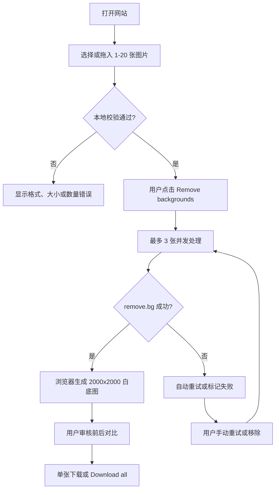

# Image Background Remover — MVP 产品需求文档

## 0. 文档说明

本文档定义面向海外电商卖家的首个可验证版本。已确认的技术边界如下：

- 使用 Cloudflare Pages 和 Cloudflare Workers 部署；
- 使用 remove.bg API 完成背景移除；
- 图片不写入 R2、数据库、KV 或其他持久化存储；
- 图片在浏览器、Cloudflare Worker 数据流和 remove.bg 之间即时传输；
- 批次状态及处理结果仅存在于当前浏览器页面；
- MVP 不包含账户、支付、历史任务和后台处理。
- 允许保存不含图片、文件名和图片 URL 的匿名产品事件与安全计数，用于验证 MVP 和防止 API 盗刷；“零存储”专指图片内容零持久化。

### 0.1 项目假设

- 首批用户为使用桌面浏览器的海外中小电商卖家；
- 单批处理量以 1–20 张为主；
- 用户可以在处理期间保持页面打开；
- MVP 由 1 名全栈开发者实现，计划周期为 10 个工作日；
- MVP 只验证用户是否需要“批量生成白底商品图”，暂不验证完整订阅商业模式。

### 0.2 成功标准

MVP 上线后四周内同时满足以下条件，视为进入 V1.0：

1. 至少 30 个去重匿名会话完成一次包含 5 张以上图片的批量任务；同一浏览器 24 小时内计为一个会话；
2. 批次完成率不低于 85%；计算公式为“至少产生 1 张成功结果的已结束批次 ÷ 已开始批次”，用户主动取消不计入分母；
3. 结果下载率不低于 70%；计算公式为“至少下载 1 张结果的批次 ÷ 至少产生 1 张成功结果的批次”；
4. 500 张评测图片中，无需额外修图即可使用的比例不低于 80%；由两名评测者按统一标准独立审核，意见不一致时由第三人裁定；
5. 与逐张使用 remove.bg 网页版相比，同一组 20 张图片从开始上传到完成下载的人工操作时间减少至少 50%；
6. 未发生图片被写入本产品持久化存储或 API Key 泄露事件。

若第 4 项未达到 80%，暂停扩展功能，优先调整模型参数、支持品类或供应商。

## 1. 产品概述

**产品名称**：Image Background Remover（工作名称）

**产品定位**：帮助海外中小电商卖家在浏览器中批量生成可用于商品上架的纯白底图片。

**目标用户**：每月需要处理 50–1,000 张商品图，但没有专职修图人员的 Amazon、Shopify、eBay 和 Etsy 卖家。

**核心场景**：用户收到一批供应商照片或准备集中上新时，一次选择多张图片，自动移除原背景、生成统一白底结果，并批量下载。

**核心矛盾**：卖家需要快速处理大量商品图，但现有操作往往需要逐张上传、逐张下载和再次调整背景，重复劳动多且容易遗漏。

**核心价值主张**：20 张商品图，一次选择，自动处理，集中审核和下载；图片不由本产品持久化保存。

## 2. MVP 范围

### 2.1 P0 — 必须有

| 功能 | 描述 | AI/API 依赖 | 验收标准 | 对应矛盾 |
|---|---|---|---|---|
| 批量导入与任务控制 | 用户一次选择最多 20 张图片，页面展示队列、总体进度和单图状态 | 无 | 支持拖放和文件选择；非法文件在调用 API 前被拒绝；并发数不超过 3；单图失败不阻塞其他图片 | 消除逐张上传 |
| 自动去背景与白底标准化 | 每张原图以二进制流发送给 Worker，由 Worker 流式构造受控的 remove.bg 请求，浏览器生成纯白底商品图 | remove.bg API、Canvas | 输出 2000×2000 JPEG；背景通过本文件定义的白色纯度检查；主体完整且等比缩放；任何图片不得写入持久化存储 | 消除逐张抠图和二次制图 |
| 结果审核与下载 | 用户在同一页面查看前后对比，重试失败图片，并单张下载或下载 ZIP | 浏览器 Blob、客户端 ZIP | 每张结果可预览和单独下载；20 张以内可生成 ZIP；ZIP 文件名不冲突；失败图片可独立重试 | 消除逐张整理和导出 |

### 2.2 P1 — V1.0 应该有

| 功能 | 描述 | 依赖 | 验收标准 |
|---|---|---|---|
| 主体占比检查 | 检查主体是否达到 Amazon 主图建议的画面占比 | Canvas 像素分析 | 超出预设范围时显示明确警告，不擅自裁切主体 |
| 输出规格选择 | 提供 Amazon、Shopify 和 Transparent PNG 三个固定预设 | 浏览器 Canvas | 切换预设后重新导出，无需再次调用 remove.bg |
| 批次质量反馈 | 用户对结果选择“可用”或“不可用”及简单原因 | 需要匿名事件或元数据存储 | 不上传图片，仅记录品类、错误类型和结果状态 |
| 付费额度 | 用户购买并消费图片额度 | Stripe、D1 或 KV | 服务端校验额度；重复请求不重复扣费；失败调用不扣产品额度 |

### 2.3 P2 — 后续考虑

| 功能 | 描述 | 暂缓理由 |
|---|---|---|
| 历史任务与稍后下载 | 保存任务及结果 | 与图片零存储和无账户 MVP 冲突 |
| 50 张以上后台批处理 | 页面关闭后继续处理 | 需要临时对象存储和服务端任务编排 |
| 人工画笔修边 | 用户手动修正蒙版 | 会把产品扩展成复杂编辑器 |
| AI 场景背景 | 生成营销场景图 | 不直接解决批量白底主图问题 |
| 团队协作与 API | 多成员、品牌预设、开放接口 | 首批个人及小团队卖家不需要 |

### 2.4 明确不做

- 不注册或登录；
- 不保存原图、结果图或处理历史；
- 不提供移动端原生应用；
- 不承诺所有商品品类均能正确抠图；
- 不提供自由画布、文字、贴纸、滤镜或模板编辑；
- 不自动上传至 Amazon 或 Shopify；
- 不从用户图片训练模型。
- 不在 Worker 中完整缓冲、解码或修改图片。

## 3. 功能详细需求

### 3.1 批量导入

#### 输入规则

- 支持 JPG、JPEG、PNG 和 WebP；
- 单批最多 20 张；
- 单张文件最大 15 MB；
- 单张最长边不得超过 10,000 像素；
- 同一批次允许文件重名，内部使用随机 ID 区分；
- GIF、SVG、HEIC、损坏文件和零字节文件不支持。

#### 交互要求

- 首屏同时提供拖放区和 `Select images` 按钮；
- 选中后立即展示本地缩略图，不自动开始付费 API 调用；
- 用户点击 `Remove backgrounds` 后开始处理；
- 开始前显示图片数量及隐私提示；
- 用户可以在任务开始前删除任意图片；
- 处理中允许取消尚未开始的图片，已发出的请求尽力通过 `AbortController` 取消。

#### 单图状态

```text
Ready → Uploading → Processing → Completed
                            ↘ Failed
Ready / Uploading / Processing → Cancelled
```

### 3.2 去背景代理

#### API 契约

| 接口 | 方法 | 输入 | 成功输出 | 作用 |
|---|---|---|---|---|
| `/api/batch-session` | POST | Turnstile Token、声明图片数量 | 10 分钟有效的签名批次令牌 | 一次验证后允许当前批次逐张请求 |
| `/api/remove-background` | POST | 原始图片二进制流；`Content-Type` 为允许的图片类型；`Authorization: Bearer <batch-token>` | remove.bg 返回的透明 PNG 数据流 | 单张去背景 |

批次令牌使用 Worker Secret 进行 HMAC 签名，至少包含随机批次 ID、签发时间、过期时间和声明图片数。它不包含用户信息、文件名或图片内容。MVP 通过 Cloudflare 速率限制和日预算限制防止重放；不承诺令牌本身提供精确计费能力。

#### 请求流程

1. 用户点击开始处理时，浏览器用 Turnstile Token 调用 `/api/batch-session`，获得 10 分钟有效的签名批次令牌；
2. 浏览器为每张图片创建独立请求，请求体为原始图片二进制流，而不是客户端可控的 multipart；
3. Worker 验证 `Origin`、批次令牌、`Content-Type`、`Content-Length` 和速率限制；
4. Worker 使用 `ReadableStream` 为原图流添加 multipart 边界、服务端固定参数 `size=auto`、`format=png` 和 `type=product`，不执行 `arrayBuffer()`、`formData()` 或图片解码；
5. Worker 从 Cloudflare Secret 注入 `X-Api-Key`，将构造后的 multipart 流发送给 remove.bg；
6. remove.bg 的成功响应体由 Worker直接流式返回浏览器；错误响应最多读取 16 KB 并映射为稳定错误码；
7. Worker 对所有响应添加 `Cache-Control: no-store`，不得写入 Cache API；
8. 浏览器将成功结果保存为临时 Blob，刷新或关闭页面即失效。

> 技术约束：客户端不能直接决定 remove.bg 的 `size`、`format` 或 `type` 参数，避免恶意请求扩大成本或绕开产品输出规范。

#### 并发与重试

- 浏览器同时最多处理 3 张；
- 网络错误和 HTTP 5xx 最多自动重试 2 次；
- HTTP 429 按 `Retry-After` 等待，若无此响应头则等待 5 秒；
- HTTP 4xx 不自动重试，并向用户提供可理解的错误信息；
- 每次重试只针对失败图片；
- 自动重试前必须确认上一次请求没有获得成功响应；
- 用户手动重试前显示可能再次消耗 API 成本的提示；
- 批次令牌过期时暂停队列，重新完成 Turnstile 验证后只继续未完成图片。

### 3.3 白底标准化

remove.bg 返回透明结果后，由浏览器逐张处理：

1. 创建离屏 Canvas；
2. 将画布设为 2000×2000；
3. 填充 `#FFFFFF`；
4. 等比缩放主体，使非透明像素边界框占画布约 85%；
5. 水平和垂直居中；
6. 导出 JPEG，质量参数为 0.92；
7. 释放中间 Canvas、ImageBitmap 和不再使用的 Object URL。

若无法可靠计算透明边界，使用 remove.bg 返回图片的整体尺寸居中，不进行裁切，并标记 `Review recommended`。

主体占比定义为透明结果中非透明像素边界框的较长边占 2000 像素画布的比例，目标为 85%，允许误差为 ±2%。任何情况下不得为了达到占比裁掉非透明像素。Alpha 大于等于 16/255 的像素视为非透明像素，以忽略孤立的极低透明度噪点。

白色背景验收不要求 JPEG 解码后的每个背景像素严格等于 255。验收脚本应在远离主体边界至少 10 像素的背景区域随机采样 1,000 个像素：至少 99.5% 的样本需满足 R、G、B 均不低于 254，且四个角像素必须满足同一条件。

### 3.4 结果审核

每张结果卡片显示：

- 原图缩略图；
- 结果缩略图；
- `Before / After` 切换；
- 当前状态；
- 原文件名；
- `Download`、`Retry`、`Remove` 操作；
- 失败时显示错误类别和建议，不显示原始堆栈或 API Key 信息。

批次顶部显示：

- 总数；
- 已完成数；
- 失败数；
- 百分比进度；
- `Download all`；
- `Clear all`。

### 3.5 下载

- 单张下载文件名为 `{原文件名去扩展名}-white-bg.jpg`；
- 重名文件依次添加 `-2`、`-3`；
- `Download all` 仅包含成功结果；
- ZIP 文件名为 `product-images-{YYYY-MM-DD}.zip`；
- 没有成功结果时禁用批量下载；
- 当成功结果 Blob 总大小超过 150 MB 时禁用 ZIP，并提示用户逐张下载；150 MB 为产品阈值，不尝试读取浏览器剩余内存；
- 下载或清空批次后不自动保留结果。

浏览器生成 ZIP 时必须逐文件压缩并显示进度。ZIP 失败不得销毁已有 Blob，用户仍可单张下载。

### 3.6 稳定错误码

| 错误码 | HTTP 状态 | 用户提示 | 是否可重试 |
|---|---:|---|---|
| `INVALID_FILE_TYPE` | 415 | This file type is not supported. | 否 |
| `FILE_TOO_LARGE` | 413 | This image is larger than 15 MB. | 否 |
| `BATCH_AUTH_REQUIRED` | 401 | Please verify again to continue this batch. | 完成 Turnstile 后继续 |
| `RATE_LIMITED` | 429 | Too many requests. Please wait and try again. | 按 `Retry-After` |
| `NO_FOREGROUND` | 422 | We could not detect a clear product in this image. | 更换图片或手动重试 |
| `UPSTREAM_UNAVAILABLE` | 503 | Background removal is temporarily unavailable. | 是，最多 2 次 |
| `DAILY_BUDGET_REACHED` | 503 | Today's free processing limit has been reached. | 次日再试 |
| `INTERNAL_ERROR` | 500 | Something went wrong. Please try again. | 是，最多 1 次 |

前端逻辑只能依赖上述稳定错误码，不得依赖 remove.bg 的原始错误文本。

## 4. AI 能力需求

### 4.1 模型/API

| 能力 | 方案 | MVP 指标 | 兜底 |
|---|---|---|---|
| 前景与背景分离 | remove.bg API | 500 张评测集中直接采用率 ≥80% | 单图重试；提示用户换图；不提供错误结果自动下载 |
| 白底构图 | 浏览器 Canvas 规则 | 输出背景像素为 `#FFFFFF`；主体不被裁切 | 无法识别边界时保留完整主体并提示审核 |

### 4.2 评测数据

| 数据 | 用途 | 规模 | 来源 | 合规要求 |
|---|---|---:|---|---|
| 商品图评测集 | 上线前判断抠图可用性 | 500 张 | 获得授权的商家样本或明确可商用素材 | 不使用来源不明图片；仅内部评测 |
| 品类分层结果 | 识别不支持的商品类型 | 每个重点品类至少 50 张 | 同上 | 只保存人工评分及错误类型时，不保留用户图片 |

评测至少覆盖：服装、鞋包、美妆、家居、首饰、毛绒、透明包装、玻璃及高反光商品。

#### 人工评测量表

每张结果按以下标准评分：

| 等级 | 定义 | 是否计入“可直接使用” |
|---|---|---|
| A | 主体完整，无明显白边、黑边或背景残留，可直接用于商品主图 | 是 |
| B | 存在轻微边缘瑕疵，但在商品列表常见展示尺寸下不可察觉 | 是 |
| C | 需要简单修边、补缺或重新构图后才能使用 | 否 |
| D | 主体缺失、透明材质严重错误、背景大面积残留或处理失败 | 否 |

“直接采用率”计算公式为 `(A + B) ÷ 全部评测图片`。除整体达到 80% 外，每个重点品类至少包含 50 张样本，并单独报告 A/B/C/D 分布，不得只报告总平均值。

### 4.3 Prompt / Agent

MVP 不使用大语言模型、Prompt 或 Agent。产品只有确定性文件处理流程和外部图片 API 调用。

### 4.4 人机边界

| 环节 | 系统负责 | 用户负责 | 交接方式 |
|---|---|---|---|
| 文件筛选 | 检查格式、大小和数量 | 确认自己有权处理图片 | 上传前提示与错误反馈 |
| 背景移除 | 调用 API 并生成结果 | 判断商品边缘和细节是否正确 | 前后对比审核 |
| 构图导出 | 自动生成统一白底和尺寸 | 决定是否采用结果 | 单张或批量下载 |
| 异常处理 | 标记失败并提供重试 | 更换图片或放弃该图片 | 单图错误卡片 |

系统不得将“API 返回成功”等同于“商品图可直接上架”。最终采用决定由用户作出。

### 4.5 兜底策略

| 失败场景 | 触发条件 | 处理方式 |
|---|---|---|
| remove.bg 超时或 5xx | 网络中断、上游异常 | 自动重试最多 2 次，仍失败则允许手动重试 |
| remove.bg 限流 | HTTP 429 | 遵循 `Retry-After`，暂停新请求并显示等待状态 |
| 无法识别主体 | 上游返回对应 4xx | 标记失败，建议更换背景更清晰的原图 |
| 结果细节错误 | 用户审核发现缺角、白边 | 允许重试；MVP 不提供手工修边 |
| 浏览器内存不足 | ZIP 生成失败或页面捕获相关异常 | 释放中间资源，保留可用结果，提示逐张下载 |
| 用户关闭页面 | 页面卸载 | 任务和结果立即丢失；开始处理前明确提示 |

## 5. 核心用户流程



## 6. 页面需求

MVP 只包含一个核心页面，不建设复杂后台。

### 6.1 落地及处理页

页面从上到下包含：

1. 标题与一句话价值主张；
2. 批量拖放上传区；
3. 隐私说明：`Images are processed in transit and are not stored by us.`；
4. 文件队列；
5. 开始处理按钮；
6. 批次进度；
7. 结果网格；
8. FAQ、支持格式、批次数量和数据处理说明。

### 6.2 关键英文文案

- 主标题：`Remove backgrounds from product photos in bulk`
- 副标题：`Turn up to 20 product photos into clean, white-background images in one batch.`
- 主按钮：`Select images`
- 处理按钮：`Remove backgrounds`
- 批量下载：`Download all`
- 隐私提示：`Your images are processed in transit and are not stored by us.`
- 页面关闭提示：`Keep this tab open until processing and downloads are complete.`

## 7. 非功能需求

| 维度 | 要求 |
|---|---|
| 性能 | 点击处理后 1 秒内出现状态反馈；在 10 Mbps 上行网络和 5 MB 测试图片下，单张端到端处理 P95 低于 25 秒；同时记录上游等待时间以区分本产品与 remove.bg 延迟 |
| 并发 | 客户端最大并发 3；单批最大 20 张 |
| 内存 | Worker 不完整缓冲原图或成功响应；浏览器逐张执行 Canvas 并及时释放资源；结果总大小超过 150 MB 时禁用 ZIP |
| 可用性 | 上游 API 故障时页面仍可加载并显示明确错误；MVP 不承诺正式 SLA |
| 隐私 | 图片不写入本产品持久化存储；响应使用 `Cache-Control: no-store`；不记录文件内容和文件名 |
| 安全 | remove.bg Key 与批次签名密钥存入不同的 Cloudflare Secrets；启用 Turnstile、短期批次令牌、Origin 校验、速率限制和文件大小限制 |
| 成本 | 每张图片正常路径只调用一次 remove.bg；记录重试原因；每个批次最多 20 张；设置账户余额告警和每日硬性调用预算 |
| 兼容性 | 支持当前及前一主版本的 Chrome、Edge、Firefox、Safari；优先桌面端 |
| 可访问性 | 所有操作可使用键盘；状态不只通过颜色表达；图片按钮具有可读标签 |
| SEO | 首屏核心内容服务端渲染；页面具有唯一标题、描述、canonical 和结构化 FAQ |

## 8. 安全与滥用防护

1. remove.bg API Key 仅存在于 Cloudflare Secret；
2. Worker 只接受 `POST /api/remove-background`；
3. 校验 `Origin`，但不把 CORS 当作防盗刷措施；
4. 用户开始任务前验证一次 Cloudflare Turnstile，由 Worker 签发 10 分钟批次令牌；不得为 20 张图片重复使用同一个 Turnstile Token；
5. 每个批次令牌最多声明 20 张；按 IP 限制为每小时最多 60 次图片请求；MVP 前端每个页面会话最多创建 1 个批次；
6. 图片请求必须提供 `Content-Length`；缺失时返回 411，超过 15 MB 时返回 413；
7. 不在日志中写入请求体、响应体、原始文件名或 API Key；
8. 上游错误对用户转换成稳定错误码，不返回内部异常栈；
9. 配置 remove.bg 余额告警；Worker 使用非图片元数据计数执行每日全站硬上限，达到后返回 `DAILY_BUDGET_REACHED`；
10. 隐私政策必须说明图片会发送给 remove.bg 处理。
11. 批次令牌不得写入 URL、分析事件或错误日志；前端仅在内存中保存。
12. 日预算计数、匿名事件和速率限制数据不包含图片、文件名、图片 URL 或 remove.bg 输出。

## 9. 埋点与验证

MVP 使用 Cloudflare Analytics Engine 或等价的匿名事件服务记录以下事件。允许保存事件和安全计数，但不保存图片内容：

| 事件 | 属性 |
|---|---|
| `batch_created` | 图片数量、格式分布、总文件大小区间 |
| `batch_started` | 图片数量、随机匿名会话 ID；会话 ID 24 小时后不再复用 |
| `image_succeeded` | 处理耗时、输入尺寸区间、重试次数 |
| `image_failed` | 稳定错误码、重试次数 |
| `image_downloaded` | 单张或 ZIP |
| `batch_completed` | 成功数、失败数、总耗时 |
| `batch_cleared` | 是否下载过、剩余结果数 |

禁止采集：原始文件名、图片URL、图片像素内容、remove.bg 原始响应体。

事件保留期默认 30 天。IP 地址只用于 Cloudflare 边缘速率限制，不写入产品分析事件。若实际分析服务会自动采集 IP，发布前必须关闭该字段或在隐私政策中披露并设定最短保留期。

## 10. 验收测试

### 10.1 核心功能

- [ ] 可一次选择 1、5、20 张合法图片；
- [ ] 第 21 张被阻止并显示明确原因；
- [ ] 15 MB 以上文件在调用 Worker 前被拒绝；
- [ ] GIF、SVG、HEIC 和损坏文件不会调用 remove.bg；
- [ ] 任意时刻最多存在 3 个处理中请求；
- [ ] 单张失败不影响同批其他图片；
- [ ] 429 响应能暂停并按规则重试；
- [ ] Turnstile 只在创建批次令牌时验证一次，20 个图片请求不重复消费同一 Turnstile Token；
- [ ] 客户端不能修改传给 remove.bg 的 `size`、`format` 和 `type` 参数；
- [ ] 成功结果为 2000×2000、白色背景 JPEG；
- [ ] 背景区域按 1,000 点采样规则达到 99.5% 的 RGB ≥254，四角像素均通过；
- [ ] 主体按比例缩放，不发生拉伸；
- [ ] 成功结果可以单独下载；
- [ ] 多个成功结果可以生成 ZIP；
- [ ] 同名原图不会覆盖 ZIP 内其他结果；
- [ ] 成功 Blob 总大小超过 150 MB 时禁用 ZIP，但仍可逐张下载；
- [ ] 清空批次后 Object URL 被释放。

### 10.2 隐私与安全

- [ ] Worker 不对原图或成功图片调用 `arrayBuffer()`、`formData()` 或执行完整响应缓冲；错误响应最多读取 16 KB；
- [ ] Cloudflare Secret 不出现在客户端包、响应和日志中；
- [ ] 请求和响应设置正确的禁止缓存策略；
- [ ] 未通过 Turnstile 的请求不能调用 remove.bg；
- [ ] 伪造、过期或写入错误声明的批次令牌不能调用 remove.bg；
- [ ] 非允许 Origin 的请求被拒绝；
- [ ] 超过速率和每日预算的请求被拒绝；
- [ ] R2、KV、D1 和 Cache API 中不存在图片数据；
- [ ] 分析事件、日志和安全计数中不存在文件名、图片 URL、批次令牌或图片内容；
- [ ] 页面及隐私政策明确披露 remove.bg 为图片处理方。

### 10.3 浏览器与异常

- [ ] Chrome、Edge、Firefox、Safari 可完成完整流程；
- [ ] 模拟断网后，失败图片可以恢复重试；
- [ ] 用户取消任务后，不再启动新的图片请求；
- [ ] ZIP 内存不足时不会导致全部已完成结果丢失；
- [ ] 仅在存在处理中任务或未下载结果时注册 `beforeunload`；浏览器显示其原生离开确认，任务清空后移除监听。

## 11. 里程碑

以下基于 1 名熟悉 TypeScript 和 Cloudflare 的全栈开发者，是计划假设而非承诺。

| 阶段 | 内容 | 交付物 | 时间 |
|---|---|---|---|
| 技术验证 | 原始图片流到受控 multipart 的流式封装、remove.bg 调用、Canvas 白底导出 | 简单页面原型和内存观测结果 | 第 1–2 个工作日 |
| 核心开发 | 批量上传、并发控制、状态机、结果预览 | 可用主流程 | 第 3–6 个工作日 |
| 下载与防护 | ZIP、重试、Turnstile 批次令牌、限速、预算上限 | 可公开测试版本 | 第 7–8 个工作日 |
| QA 与上线 | 浏览器测试、隐私检查、500 张评测抽样 | Cloudflare MVP | 第 9–10 个工作日 |

## 12. 发布门槛

公开发布前必须全部满足：

1. 500 张评测集整体直接采用率不低于 80%；
2. 任一重点品类采用率低于 60%时，在页面明确标记为暂不支持或限制；
3. 完成一次 API Key 泄露检查；
4. 完成一次图片零持久化检查；
5. 设置 remove.bg 日预算和异常调用告警；
6. 隐私政策、服务条款和第三方处理说明可访问；
7. 20 张批次在四个目标浏览器上通过验收。
8. 使用 15 MB 输入文件进行 3 并发压力测试，Worker 无内存超限错误。

## 13. 矛盾回溯检查

| 检查项 | 结论 |
|---|---|
| P0 是否直接解决主要矛盾？ | ✅ 三项分别消除逐张上传、逐张处理和逐张导出 |
| P0 是否不超过 3 个？ | ✅ 共 3 个 |
| 是否把次要需求误列为 P0？ | ✅ 账户、支付、平台扩展和 AI 场景均后置 |
| 人机边界是否合理？ | ✅ 系统负责自动化，用户负责最终质量判断 |
| 主次矛盾转化后能否适应？ | ⚠️ 若抠图质量不再是问题，下一矛盾将是平台合规与后台批量，需要进入 V1.0 重新评审 |

## 14. 可执行性检查

| 检查项 | 结论 |
|---|---|
| 1 人能否支撑 MVP？ | ✅ 单页面、单供应商、无账户和无存储，范围可控 |
| AI 能力是否现成？ | ✅ remove.bg 提供正式 API；仍需用真实商品图验证质量 |
| 评测数据是否就绪？ | ⚠️ 尚未确认，需要在开发期间取得 500 张合法样本 |
| 10 个工作日能否交付？ | ⚠️ 适用于熟悉 Cloudflare 的开发者；不包含品牌视觉和正式付费系统 |
| 外部依赖是否可控？ | ⚠️ 依赖 remove.bg 可用性、额度、价格及 Cloudflare 限制 |

## 15. 已决策项与剩余依赖

### 15.1 本版已决策

- 免费 MVP：每个页面会话 1 个批次，每批最多 20 张；同一 IP 每小时最多 60 次图片请求；
- P0 只输出 2000×2000、`#FFFFFF` 背景的 JPEG，不提供透明 PNG 下载；
- 产品工作名称为 Image Background Remover，界面语言为英文；
- 允许保存 30 天的匿名产品事件与安全计数，但禁止保存图片、文件名、图片 URL 和批次令牌；
- 图片始终零持久化，处理结果仅保留在当前浏览器页面内存中。

### 15.2 发布前仍需落实

1. 确定并取得 500 张合法评测图片；这是当前唯一阻塞公开发布的数据依赖；
2. 确定正式域名；不阻塞本地开发和 Cloudflare 预览部署；
3. 根据可接受的 remove.bg 日成本填写全站每日硬性调用上限；不得在未设上限时公开发布。

---

*文档版本：v0.2 | 创建日期：2026-07-12 | 负责人：待定*
